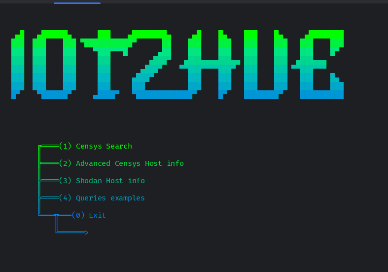
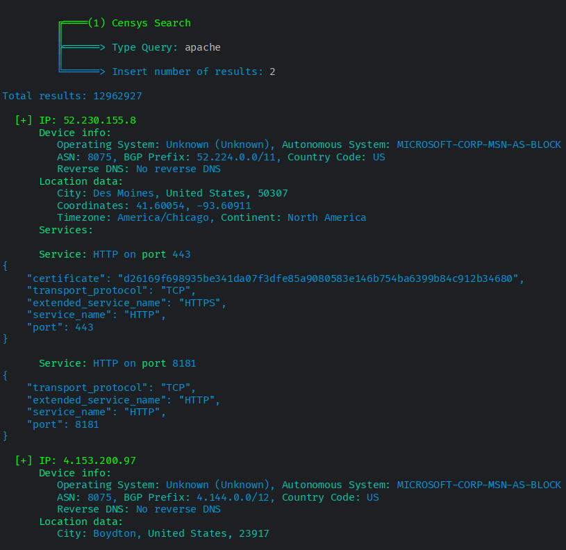
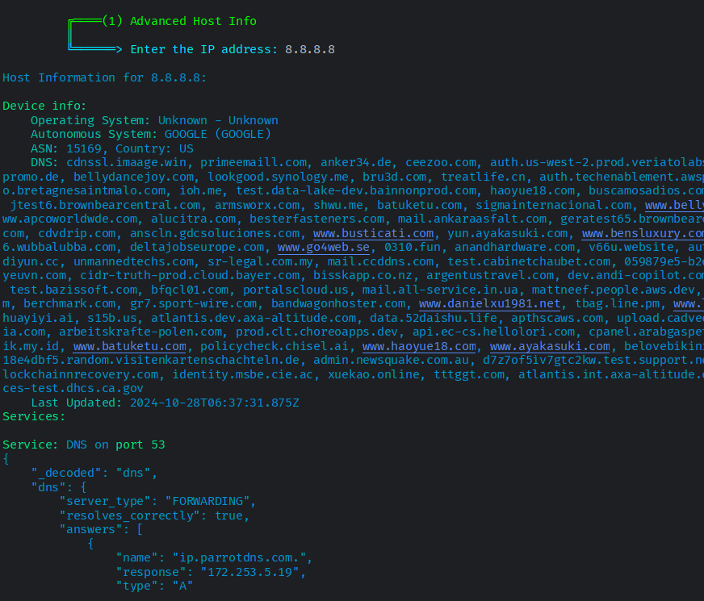
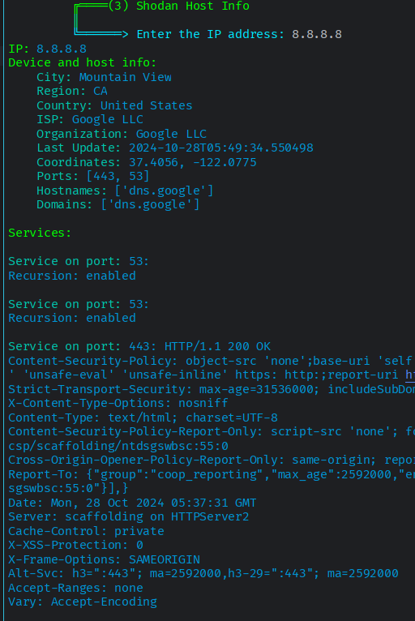

# Shodan & Censys IOT scanner
Multitool that scans all kinds of devices on the internet such as servers, iot, web servers, databases and more using Censys and Shodan api. Also contains a list of useful queries to use.

# 💻 Code


The code is just a multitool-styled menu with options:

- **Censys Search**: uses censys api to lookup specific devices on the internet, you can specify the number of results.
- **Censys host info**: uses censys api to get informations on a specific devices. more info on the #scanner section.
- **Shodan info**: uses shodan free api (which kinda sucks) to lookup iot devices on the web.
- **Queries examples**: shows a long list of examples of queries to lookup on shodan, censys or google dork.

The Apis are free to obtain on the specific websites, i put all of them in a .env file.

# 📡 Scanner



**```Censys Search```**: The first scanner uses censys api as i said before, it's not as complete as the shodan one but it does its job, the api key is free to obtain on their website. Sorry if the results in the example are your apache servers XD.
In order to get the api to work, during the get request i sent the credentials as b64 encoded headers and other info such as the number of results as parameters, i don't know why they have to be encoded but it works so dont complain, the requests is then shown, and every "service" of the ip is listed. The service can be an open port, a vulnerability or anything like that.
Be aware that some shodan queries might not work on Censys website and some might not work used via api, dont ask me why.



**```Censys host info```**: The second scanner is quite simple, it gives every piece of information possible on a given address using the censys api.
Just like the Censys search, it gets every open port, vulnerabilty, key or anything it can find about a device and prints it as a Service, the results are sometimes formatted if the informations are too many.
On the right u can see some examples of the scanners, yes i put the photos as small as possible, you can easily view them by right clicking them and opening them in a new tab. All the pictures are in the ```media``` folder.



**```Shodan info```**: 


# 📋 Queries
The query list is just a list of examples taken from websites and github pages. 

