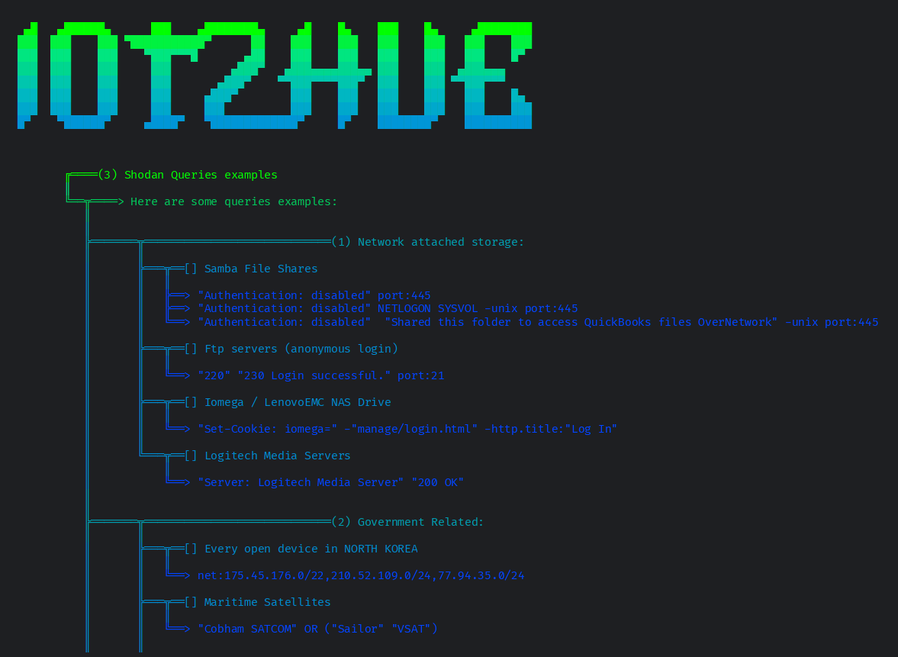

# Shodan & Censys IOT scanner
Multitool that scans all kinds of devices on the internet such as servers, iot, web servers, databases and more using Censys and Shodan api. Also contains a list of useful queries to use.

# 💻 Code


The code is just a multitool-styled menu with options:

- **Censys Search**: uses censys api to lookup specific devices on the internet, you can specify the number of results.
- **Censys host info**: uses censys api to get informations on a specific devices. more info on the #scanner section.
- **Shodan info**: uses shodan free api (which kinda sucks) to lookup iot devices on the web.
- **Queries examples**: shows a long list of examples of queries to lookup on shodan, censys or google dork.

The Apis are free to obtain on the specific websites, i put all of them in a .env file.

# 📡 Scanners


**```Censys Search```**: The first scanner uses censys api as i said before, it's not as complete as the shodan one but it does its job, the api key is free to obtain on their website. Sorry if the results in the example are your apache servers XD.
In order to get the api to work, during the get request i sent the credentials as b64 encoded headers and other info such as the number of results as parameters, i don't know why they have to be encoded but it works so dont complain, the requests is then shown, and every "service" of the ip is listed. The service can be an open port, a vulnerability or anything like that.
Be aware that some shodan queries might not work on Censys website and some might not work used via api, dont ask me why.


**```Censys host info```**: The second scanner is quite simple, it gives every piece of information possible on a given address using the censys api.
Just like the Censys search, it gets every open port, vulnerabilty, key or anything it can find about a device and prints it as a Service, the results are sometimes formatted if the informations are too many.
On the right u can see some examples of the scanners, yes i put the photos as small as possible, you can easily view them by right clicking them and opening them in a new tab. All the pictures are in the ```media``` folder.


**```Shodan info```**: The third scanner is not actually a scanner but rather a code that gives informations on a device, this time using the shodan Api. 

Actually i wanted to use the shodan api to insert a Search tool, but since 2022 i think Shodan modified the api so that basically now u gotta pay to use all of its functionalities. We live in a society... So now the free tier api allows you to do next to nothing, you can simply look up informations on a given device ip, but sometimes it doesn't work for unknown reasons, it allows you to search for devices with queries and filters, but you can only know the NUMBER of results for that given request... which is useless. 

Anyways the scanner is more accurate than the Censys scan, it prints every service such as open ports, vulns, etc... and formats the results when informations are too many.


# 📋 Queries



The query list is just a list of examples taken from websites and github pages. Here's an quick overview, note that i did not include everything here, check the code to see the complete list:

<!--

#### - Network Attached Storage: 
- Ftp servers,
- Nas drives,
- Media servers,
- Samba file shares

#### - Government related: 
- North korea based devices,
- Maritime satellites
- Submarine mission control dashboards,
- Voting Machines,
- Prison pay phones

#### - Webcams:
- Yawcams,
- Webcam7/WebcamXP
- Android IP Webcam servers,
- Security DVRs

#### - 
 -->


#### 1. Network Attached Storage
- Samba File Shares
  - "Authentication: disabled" port:445
  - "Authentication: disabled" NETLOGON SYSVOL -unix port:445
  - "Authentication: disabled" "Shared this folder to access QuickBooks files OverNetwork" -unix port:445
- FTP Servers (Anonymous Login)
  - "220" "230 Login successful." port:21
- Iomega / LenovoEMC NAS Drive
  - "Set-Cookie: iomega=" -\"manage/login.html\" -http.title:"Log In"
- Logitech Media Servers
  - "Server: Logitech Media Server" "200 OK"
#### 2. Government Related
- Every Open Device in North Korea
  - net:175.45.176.0/22,210.52.109.0/24,77.94.35.0/24
- Maritime Satellites
  - "Cobham SATCOM" OR ("Sailor" "VSAT")
- Submarine Mission Control Dashboards
  - title:"Slocum Fleet Mission Control"
- Voting Machines (US)
  - "voter system serial" country:US
- Prison Pay Phones
  - "Encartele Confidential"
#### 3. Webcams
- Yawcams
  - "Server: yawcam" "Mime-Type: text/html"
- WebcamXP/Webcam7
  - ("webcam 7" OR "webcamXP") http.component:"mootools" -401
- Android IP Webcam Servers
  - "Server: IP Webcam Server" "200 OK"
- Security DVRs
  - html:"DVR_H264 ActiveX"
#### 4. Printers and Copiers
- HP Printers
  - "Serial Number:" "Built:" "Server: HP HTTP"
- Xerox Copiers/Printers
  - ssl:"Xerox Generic Root"
- Epson Printers
  - "SERVER: EPSON_Linux UPnP" "200 OK"
  - "Server: EPSON-HTTP" "200 OK"
- Canon Printers
  - "Server: KS_HTTP" "200 OK"
  - "Server: CANON HTTP Server"
#### 5. Home Devices
- Apple Airplay Receivers
  - "\\x08_airplay" port:5353
- Smart TVs or Chromecasts
  - "Chromecast:" port:8008
- Crestron Smart Home Controllers
  - "Model: PYNG-HUB"
- Octoprint 3D Printers
  - title:"OctoPrint" -title:"Login" http.favicon.hash:1307375944
#### 6. Industrial Control Systems, RDP & Network Infrastructure
Samsung Electronic Billboards
"Server: Prismview Player"


